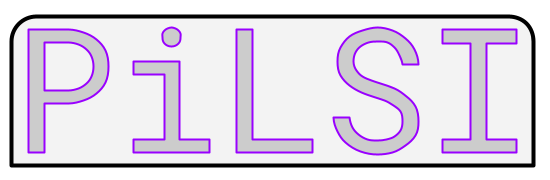

## Introduction

This repository is a Laravel built site create to support the online version of the PiLSI.  It consists of a few things:

* a rudimentary cave index
* the PiLSI database

## Tech used

This site uses the Laravel Framework, as well as the very useful Filament package for the admin area.  Thanks to the respective teams!

## About PiLSI

A squeeze is a passage or element of a cave that requires careful consideration or planning of body positioning and movement to pass through.1  

Utilising the Pilkington-Lewis Squeeze Index (PiLSI) cave constrictions can be rated similarly to the climbing grades used by rock climbers.

PiLSI ratings can be easily added to  cave maps to convey details on the shape, incline, moisture level, hazards and degree of difficulty in a concise manner.

Two pieces of information are mandatory: the difficulty rating (1-15) and the structure description (eg. C for corkscrew). There are multiple optional descriptors for added detail.

The PiLSI is easy to understand and implement in any cave setting and corresponding cave map, which can aid in route planning and training exercises.

The PiLSI is named after prominent South Australian cavers Graham Pilkington (photo below left) and Ian Lewis (photo below right).

## Dev notes

I've configured the .env file to use the following ports:

- 3000 for the webite
- 3306 for MySQL

You can start the application with:

    sail up -d

Once running see the site with:

    http://localhost:3000/

Filament is installed to for managing the admin area.  You can create a user with

    sail artisan make:filament-user

Admin section can be found at this location in case future me forgets:

    http://localhost:3000/admin
