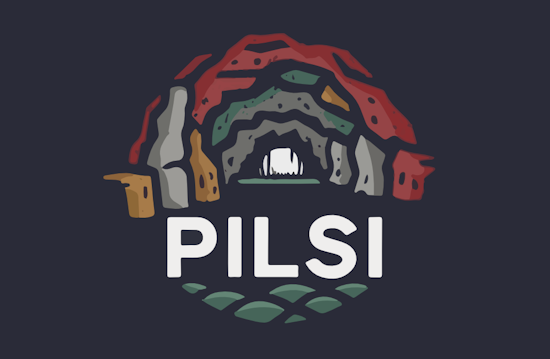

## Introduction

This repository is a Laravel built site create to support the online version of the PiLSI.  It consists of a few things:

* a rudimentary cave index
* the PiLSI database

## Tech used

This site uses the Laravel Framework, as well as the very useful Filament package for the admin area.  Thanks to the respective teams!

## About PiLSI

A squeeze is a passage or element of a cave that requires careful consideration or planning of body positioning and movement to pass through.

Utilising the Pilkington-Lewis Squeeze Index (PiLSI) cave constrictions can be rated similarly to the climbing grades used by rock climbers.

PiLSI ratings can be easily added to  cave maps to convey details on the shape, incline, moisture level, hazards and degree of difficulty in a concise manner.

Two pieces of information are mandatory: the difficulty rating (1-15) and the structure description (eg. C for corkscrew). There are multiple optional descriptors for added detail.

The PiLSI is easy to understand and implement in any cave setting and corresponding cave map, which can aid in route planning and training exercises.

The PiLSI is named after prominent South Australian cavers Graham Pilkington (photo below left) and Ian Lewis (photo below right).

## Dev notes

### Setting up your dev environment

For local development I've been using [Laravel Sail](https://laravel.com/docs/10.x/sail).  To get it up and running, make sure you do the following:

    cp .env.example .env
    composer install
    sail up -d
    sail composer update
    sail artisan key:generate
    sail artisan migrate:fresh --seed

You'll probably need to add yourself as a user:

    sail artisan make:filament-user

If this is the first time running the site, you'll need to get the frontend ready with

    sail npm install
    sail npm run dev

All things going well, access the site with:

* [Frontend](http://localhost:3000)
* [Admin](http://localhost:3000/admin)

### Technical info

I've configured the .env file to use the following ports:

* 3000 for the website
* 3306 for MySQL

Feel free to change them to suit your needs

### Daily operations

You can start the application with:

    sail up -d

*Laravel Vite* is used to build the css and js.  You can do this with:

    sail npm run build

You can also set it to watch if you fancy:

    sail npm run dev

[Laravel Pint](https://laravel.com/docs/10.x/pint) is installed so you can use this tool to tidy up your code after you've mangled it:

    sail pint

### localhost troubleshooting

If you find that images aren't loading propery, it's likely that the public disk filesystem isn't published.  Try the following:

    sail artisan storage:link

### Credits

This site leverages the following frameworks and libraries:

* [Laravel](https://laravel.com/)
* [Filament](https://filamentphp.com/)
* [Blade Icons](https://github.com/blade-ui-kit/blade-icons)
* [Feather Icons](https://github.com/brunocfalcao/blade-feather-icons)
* [Filament Shield](https://github.com/bezhanSalleh/filament-shield)
* [Filament Breezy](https://github.com/jeffgreco13/filament-breezy)
* [Filament Gravatar](https://github.com/awcodes/filament-gravatar)
